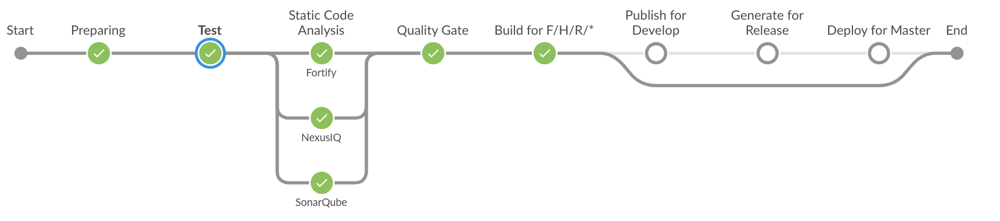
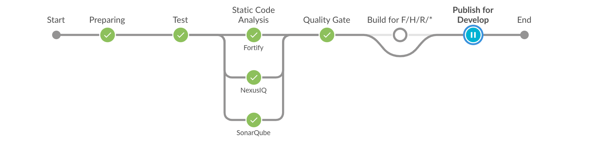
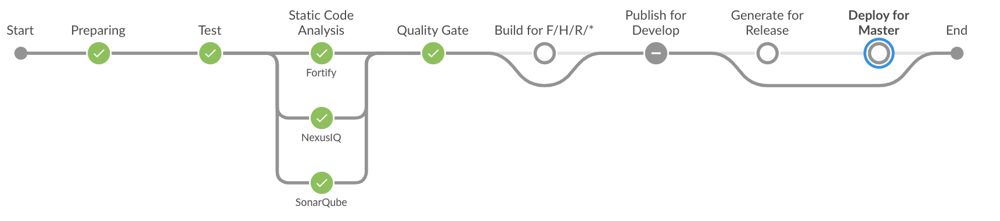

# jenkins

[Multi-branch Jenkins Pipeline](https://jenkins.io/doc/tutorials/build-a-multibranch-pipeline-project/)

##### Feature Branch Pipeline

##### Develop Branch Pipeline

##### Master Branch Pipeline

### Reference

- [nx-jenkins-build](https://github.com/nrwl/nx-jenkins-build)
