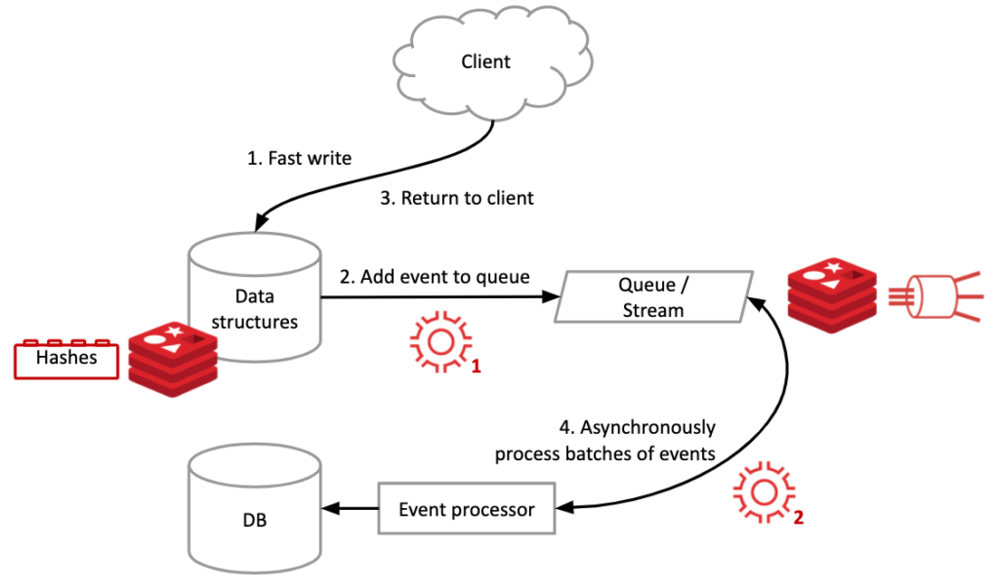

# Redis CRDT

Contents:

- [Active-Active](#active-active)
  - [Summary](#summary)
    - [Issue](#issue)
    - [Decision](#decision)
    - [Status](#status)
  - [Details](#details)
    - [Assumptions](#assumptions)
    - [Constraints](#constraints)
    - [Positions](#positions)
    - [Argument](#argument)
    - [Implications](#implications)
  - [Related](#related)
    - [Related decisions](#related-decisions)
    - [Related requirements](#related-requirements)
    - [Related artifacts](#related-artifacts)
    - [Related principles](#related-principles)
  - [Notes](#notes)

## Summary

**Geo-Distributed Active-Active** deployment for **Keying&Linking** means ability to process *online/streaming/batch* workloads from multiple regions simultaneously.

### Issue

Writes to BigTable(BT) are **evneuvaly consistent** when BT replication is enabled across regions. 
This may lead to data inconsistency when transactions are processed simultaneously in both regions

### Decision

**Read-through** cache sits in-line with the database. When there is a cache miss, it loads missing data from database, populates the cache and returns it to the application.

**read-through / write-through cache**

  

With **write-through** cache strategy, data is first written to the cache and then to the database. The cache sits in-line with the database and writes always go through the cache to the main database.

when paired with **read-through** caches, we get all the benefits of **read-through** and we also get data consistency guarantee, freeing us from using cache invalidation techniques.

**read-through / write-behind cache**

  

Here, the application writes data to the cache which acknowledges immediately and after some delay, it writes the data back to the database.

**Write-behind** caches improve the write performance and are good for **write-heavy** workloads. When combined with **read-through**, it works good for mixed workloads, where the most recently updated and accessed data is always available in cache.

**read-direct / write-behind cache**

  

**RedisGears** runs with-in **Redis** and enable updating backend DB when transactions are received by Redis.

Redis multi-cluster  conflict-free replication enables to sync **writes** between regions.

### Status

Not Decided. Open to discussion.

## Details

Replication of BigTable is slow, don't support CRDTs (​conflict-free replicated data types)

### Assumptions

infra is Geo-Distributed for Active-Active processing.

### Constraints

### Positions

### Argument

### Implications

## Related

### Related decisions

### Related requirements

### Related artifacts

- [Caching Strategies and How to Choose the Right One](https://codeahoy.com/2017/08/11/caching-strategies-and-how-to-choose-the-right-one/)
- [Write-behind and read-through with RedisGears, Redis Labs](https://www.youtube.com/watch?v=J3eCZJGVze4)
- [Write-behind implementation](https://redislabs.com/blog/redisgears-serverless-engine-for-redis/)
- [Active-Active Geo-Distribution (CRDTs-Based)](https://redislabs.com/redis-enterprise/technology/)

### Related principles

## Notes
