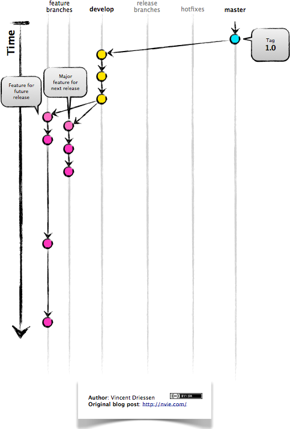
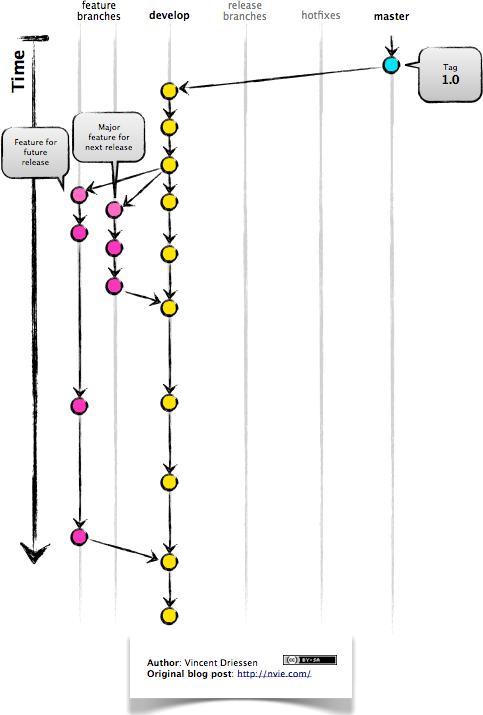
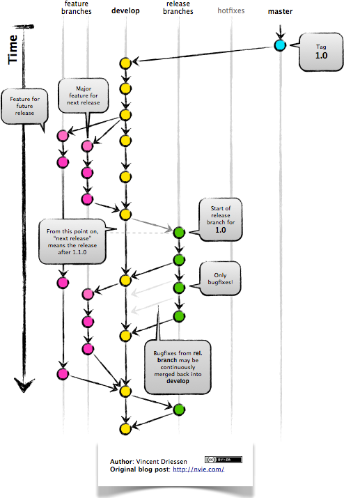
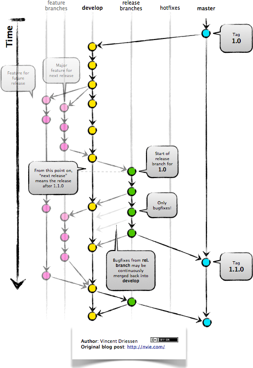

# Gitflow

## What Is Gitflow?

[Gitflow](http://nvie.com/posts/a-successful-git-branching-model/) is a branching model for Git, created by [Vincent Driessen](https://nvie.com/about/).  
It has attracted a lot of attention because it is very well suited to collaboration and scaling the development team.

## How It Works

### Feature Branches

New development (new features, non-emergency bug fixes) are built in __feature branches__:

Feature branches are branched off of the __develop branch__, and finished features and fixes are merged back into the __develop branch__ when they're ready for release:

### Release Branch

When it is time to make a release, a __release branch__ is created off of __develop__:

The code in the __release branch__ is deployed onto a suitable test environment, tested, and any problems are fixed directly in the release branch.  This __deploy -> test -> fix -> redeploy -> retest__ cycle continues until you're happy that the release is good enough to release to customers.

When the release is finished, we generate __CHANGELOG.md__  using tools like [git-chglog](https://github.com/git-chglog/git-chglog) from commits.

Then, the __release branch__ is merged into __master__ **and** into __develop__ too, to make sure that any changes made in the __release branch__ aren't accidentally lost by new development.

### Master Branch

The __master branch__ tracks released code only.  The only commits to __master__ are merges from __release branches__ and __hotfix branches__.

### Hotfix Branches

__Hotfix branches__ are used to create emergency fixes:

- Hotfixes arise from the necessity to act immediately upon an undesired state of a live production version
- May be branched off from the corresponding tag on the master branch that marks the production version.

They are branched directly from a tagged release in the __master branch__, and when finished are merged back into both __master__ and __develop__ to make sure that the hotfix isn't accidentally lost when the next regular release occurs.

## Reference 

- [BitBucket Gitflow Workflow](https://www.atlassian.com/git/tutorials/comparing-workflows/gitflow-workflow)
- [GitFlow Cheat Sheet](http://danielkummer.github.io/git-flow-cheatsheet/)