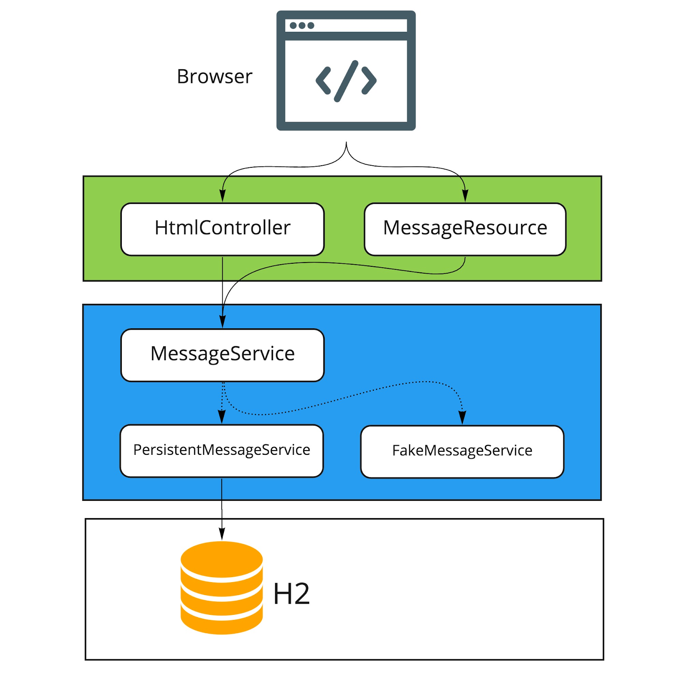

# Chat App

**SpringBoot** app showcasing *Kotlin Coroutines* and *RSocket*

## Overview

<p align="center">
  
</p>

## Run

```bash
gradle :services:chat:bootRun
# log at debug level
gradle :services:chat:bootRun --debug
```

Open two browser tabs and start chatting...

```bash
open http://localhost:8080/
```

## Build

### Build fatJar

```bash
gradle :services:chat:build
```

### Build native image

```bash
gradle :services:chat:bootBuildImage 
```

### Reference

* [Spring Boot with Kotlin and RSocket](https://spring.io/guides/tutorials/spring-webflux-kotlin-rsocket/)
* [Original Repo](https://github.com/kotlin-hands-on/kotlin-spring-chat)
